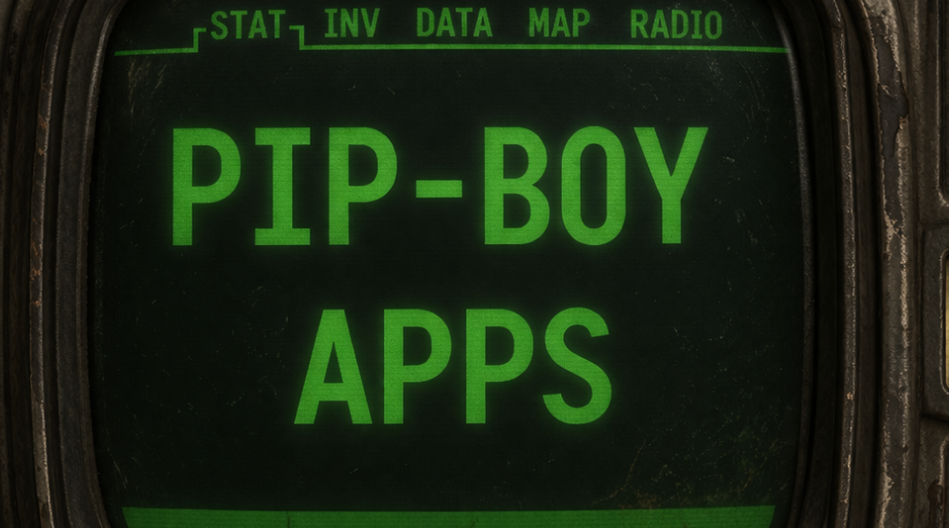

<div align="center">
  
  <h1 align="center">Pip-Boy 3000 Mk V Apps</h1>
  <p align="center">
    A community driven repository of custom applications and games for the 
    <a href="https://www.thewandcompany.com/fallout-pip-boy/" target="_blank">Pip-Boy 3000 Mk V</a>, 
    hosted on <a href="https://www.pip-boy.com/" target="_blank">pip-boy.com</a>.
  </p>
  <p align="center">
    <a href="https://pip-boy.com" target="_blank">
      Pip-Boy.com
    </a>&nbsp;|&nbsp;
    <a href="https://discord.com/invite/zQmAkEg8XG" target="_blank">
      Discord Community
    </a>&nbsp;|&nbsp;
    <a href="https://gear.bethesda.net/products/fallout-series-pip-boy-die-cast-replica" target="_blank">
      Bethesda Store
    </a>&nbsp;|&nbsp;
    <a href="https://www.thewandcompany.com">
      The Wand Company
    </a>&nbsp;|&nbsp;
    <a href="https://www.espruino.com" target="_blank">
      Espruino
    </a>
  </p>
</div>

<!---------------------------------------------------------------------------->
<!---------------------------------------------------------------------------->
<!---------------------------------------------------------------------------->

## Index <a name="index"></a>

- [Description](#description)
- [Iteration History](#iterations)
- [Prerequisites](#prerequisites)
- [Create a New App or Game](#create-a-new-app-or-game)
- [Contributing](#contributing)
- [Scripts](#scripts)
- [License](#license)
- [Wrapping Up](#wrapping-up)

<!---------------------------------------------------------------------------->
<!---------------------------------------------------------------------------->
<!---------------------------------------------------------------------------->

## Description <a name="description"></a>

Welcome to the third iteration of the Pip-Boy 3000 Mk V Apps repository.

This is a community driven collection of custom applications and games built for
the Pip-Boy 3000 Mk V, the wearable device created by Bethesda and The Wand
Company.

The apps and games in this repository are provided on
[pip-boy.com](https://pip-boy.com).

<p align="right">[ <a href="#index">Index</a> ]</p>

<!---------------------------------------------------------------------------->
<!---------------------------------------------------------------------------->
<!---------------------------------------------------------------------------->

## Iteration History <a name="iterations"></a>

For historical purposes, previous repositories have been kept online so others
can reference them if needed. Check them out below if you're interested in the
history of this project!

### First Iteration (March, 2025)

The custom apps repository before the release of the official app-loader and
fork below.

- https://github.com/CodyTolene/pip-apps

### Second Iteration (June, 2025)

A forked version of the official app-loader that grew way beyond its original
scope (300+ commits). This version didn't show contributor names in GitHub and
their hard work, which is one of the main reasons for this next, third
iteration.

- https://github.com/CodyTolene/pip-boy-apps

### Third Iteration (April, 2026 - Present)

This repository, with revamped structure and tooling to make it easier for
contributors to add their apps and games to [pip-boy.com](https://pip-boy.com).
This version shows contributor names in GitHub since it's not a fork.

- https://github.com/CodyTolene/pip-boy-3000-mk-v-apps

<p align="right">[ <a href="#index">Index</a> ]</p>

<!---------------------------------------------------------------------------->
<!---------------------------------------------------------------------------->
<!---------------------------------------------------------------------------->

## Prerequisites <a name="prerequisites"></a>

- You'll need [Node.js][link-node-js] for running any scripts in the
  `package.json` file.
- An IDE for making changes to the codebase (e.g. [Visual Studio
  Code][link-vs-code]).

<p align="right">[ <a href="#index">Index</a> ]</p>

<!---------------------------------------------------------------------------->
<!---------------------------------------------------------------------------->
<!---------------------------------------------------------------------------->

## Create a New App or Game <a name="create-a-new-app-or-game"></a>

To create a new app or game, add a new folder under the `apps` or `games`
directory with the following structure:

```sh
app.js
ChangeLog
metadata.json
README.md
```

- `app.js`: The main JavaScript file for your app or game.
- `ChangeLog`: A log of changes made to the app or game.
- `metadata.json`: A JSON file containing metadata about your app or game.
- `README.md`: A markdown file with detailed information about your app or game.

> ![info][img-info] The `.js` file names and locations can vary. See other apps
> and games for examples.

<p align="right">[ <a href="#index">Index</a> ]</p>

<!---------------------------------------------------------------------------->
<!---------------------------------------------------------------------------->
<!---------------------------------------------------------------------------->

## Contributing <a name="contributing"></a>

1.  Clone the repository and create a new branch for your changes:

    ```sh
    git clone https://github.com/CodyTolene/pip-boy-3000-mk-v-apps.git
    ```

2.  Create a new branch for your changes:

    ```sh
    git checkout -b your-feature-branch
    ```

3.  Make your changes to the codebase, start with creating a new app or game
    folder in the `apps` or `games` directory, and add your app's source code
    and metadata.

    > ![info][img-info] See required files and metadata in the
    > [Create a new App or Game](#create-a-new-app-or-game) section below.

4.  Add and commit your changes:

    ```sh
    git add .
    git commit -m "Your commit message"
    ```

5.  Push your changes:

    ```sh
    git push origin your-feature-branch
    ```

6.  Create a pull request on GitHub to merge your changes into the main branch:

    https://github.com/CodyTolene/pip-boy-3000-mk-v-apps/pulls

<p align="right">[ <a href="#index">Index</a> ]</p>

<!---------------------------------------------------------------------------->
<!---------------------------------------------------------------------------->
<!---------------------------------------------------------------------------->

## Scripts <a name="scripts"></a>

```sh
npm run <script>
```

| Script   | Description                          |
| -------- | ------------------------------------ |
| `build`  | Builds the apps and games list.      |
| `format` | Formats the codebase using Prettier. |

<p align="right">[ <a href="#index">Index</a> ]</p>

<!---------------------------------------------------------------------------->
<!---------------------------------------------------------------------------->
<!---------------------------------------------------------------------------->

## License <a name="license"></a>

This project is licensed under the MIT License.

Some apps and games in this repository may have their own licenses. Check each
app or game's individual files and README for license terms that apply to that
specific project.

See the [LICENSE-MIT](LICENSE-MIT) file for more details.

`SPDX-License-Identifiers: MIT`

<p align="right">[ <a href="#index">Index</a> ]</p>

<!---------------------------------------------------------------------------->
<!---------------------------------------------------------------------------->
<!---------------------------------------------------------------------------->

## Wrapping Up <a name="wrapping-up"></a>

Thank you to Bethesda & The Wand Company for such a fun device to tinker with!
If you have any questions, please let me know by opening an issue
[here][link-new-issue].

Cody Tolene

<p align="right">[ <a href="#index">Index</a> ]</p>

<!---------------------------------------------------------------------------->
<!---------------------------------------------------------------------------->
<!---------------------------------------------------------------------------->

<!-- IMAGE REFERENCES -->

[img-info]: .github/images/ng-icons/info.svg
[img-warn]: .github/images/ng-icons/warn.svg

<!-- LINK REFERENCES -->

[link-new-issue]:
  https://github.com/CodyTolene/pip-boy-3000-mk-v-apps/issues/new
[link-node-js]: https://nodejs.org/en
[link-vs-code]: https://code.visualstudio.com/
